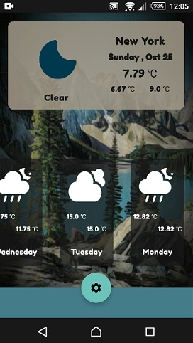
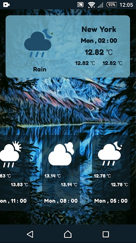
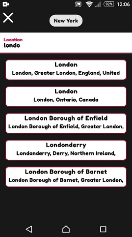
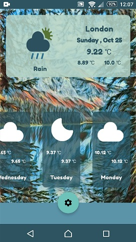

<h1 align="center"> WeatherApp </h1>
 

    

#### `Introduce`

WeatherApp is an application developed using modern Android development tools and has features such as viewing the current weather conditions and forecasting the next few days, has no location restrictions, and supports all regions of the world.

#### `Screenshot` 

  
   
   
   
   
  

  

 
  
### `Tools & Dependencies`
* Clean Ahitecture(MVVM)
* Single Activity
* Google Material Design
* Jetpack Navigation Component
* Jetpack Room Database
* Retrofit- Network Requests
* Dagger- Dependency Injection
* RxJava/RxAndroid- Reacttive Programming
* Kotlin DSL
* [OpenWeatherMap API](https://openweathermap.org/api)

 

[Show Demo Video](https://drive.google.com/file/d/1LVR2sEA5wRbk5WRZl5K6w_gXOlXdmcRQ/view?usp=sharing)

[Download Demo apk](https://drive.google.com/file/d/1ZE4NvkX1QFaZmwbTcoWBSpBJcl6F8Hvk/view?usp=sharing)

